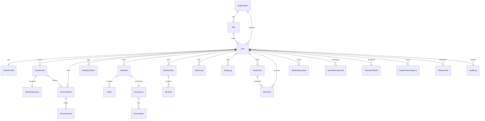

# PDHRS — Database

PostgreSQL (Supabase) modelled with Prisma. The schema lives in
[`prisma/schema.prisma`](../prisma/schema.prisma); Supabase-specific extras
(pgvector, RLS, audit triggers) live in
[`supabase/migrations/0001_extensions_and_rls.sql`](../supabase/migrations/0001_extensions_and_rls.sql).

## ER Diagram

## Key design decisions

- **`users.id` mirrors Supabase `auth.users.id`** (the auth uid) so RLS policies
  can use `auth.uid() = "userId"` directly.
- **`RiskAssessment` is a 1:1 cache** of the deterministic engine output for an
  MCU record — fast reads, reproducible from the engine at any time.
- **`HealthIndexSnapshot`** is the source of truth for trend/forecast charts
  (one row per user per day, unique).
- **`KnowledgeChunk.embedding vector(1536)`** is added by raw SQL because Prisma
  has no native `vector` type; retrieval uses the `match_knowledge()` RPC.
- **Audit**: an `AFTER` trigger writes before/after JSON snapshots to `audit_logs`
  for the most sensitive tables (MCU, risk, fitness-for-work, surveillance, docs).

## Indexes

Defined in the Prisma schema via `@@index` / `@@unique`, e.g.:

- `mcu_records (userId, examDate)`
- `recovery_plans (userId, status)`
- `weekly_checkins (userId, weekStart)` _unique_
- `water_logs (userId, date)` / `sleep_logs (userId, date)` _unique_
- `health_index_snapshots (userId, date)` _unique_
- `ai_interactions (userId, agent, createdAt)`
- `audit_logs (entity, entityId)`, `(createdAt)`
- `knowledge_chunks` IVFFlat cosine index on `embedding`

## Roles (RBAC)

`USER` · `CLINICIAN` · `HSE` · `ADMIN` · `AUDITOR` — enforced in the app layer and
reinforced by Row Level Security at the database layer.
